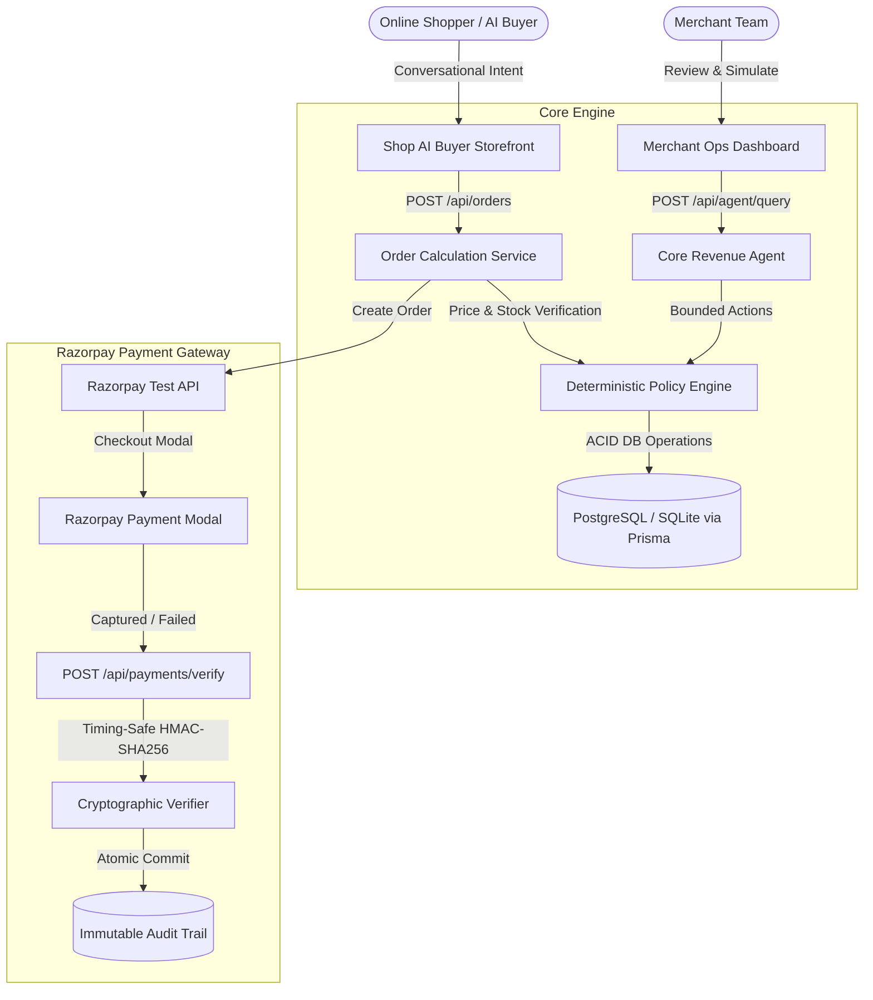

# RAYFLOW — Autonomous AI Revenue Agent for Agentic Commerce

[](https://www.typescriptlang.org/)
[](https://nextjs.org/)
[](https://www.prisma.io/)
[](https://www.docker.com/)
[](https://razorpay.com/)
[](https://opensource.org/licenses/MIT)

> **Core Architectural Invariant:**  
> *"AI may recommend. Deterministic systems decide. Policies constrain. Humans approve where required. The payment gateway verifies. The database records. The audit trail remembers."*

---

## 🌟 Executive Summary

**RAYFLOW** is a full-stack autonomous AI revenue copilot and agentic commerce storefront powered by Razorpay test-mode commerce.

1. **Grows Merchant Revenue**: Continuously calculates high-affinity bundle recommendations, checkout recovery incentives, and targeted campaigns from database telemetry.
2. **Agentic Commerce Storefront**: Enables shoppers and external AI agents to browse real-time inventory, negotiate policy-bounded incentives, and complete Razorpay test checkouts.
3. **Deterministic Safety Guards**: Enforces a strict, zero-hallucination **Policy Engine** with hard discount caps (<= 20%), campaign limits, and merchant-specific approval thresholds.
4. **Cryptographic Verification**: Server-side timing-safe HMAC-SHA256 signature verification (`crypto.timingSafeEqual`) for all test-mode payments and webhooks with idempotent ledger recording.
5. **Strict Multi-Tenancy**: Tenant context is resolved strictly from verified server-side JWT session cookies—cross-tenant data leakage is cryptographically prevented.

---

## 🏗 System Architecture



---

## ⚙️ Prerequisites

- **Node.js**: `v20.x` or higher
- **npm**: `v10.x` or higher
- **Docker & Docker Compose** *(Optional for local containerized PostgreSQL)*
- **Git**

---

## 🚀 Quick Start (Local Setup)

### Option A: Zero-Config Local Setup (SQLite)

```bash
# 1. Clone the repository
git clone https://github.com/your-org/rayflow.git
cd rayflow

# 2. Install dependencies (initializes Husky hooks)
npm install

# 3. Configure environment
cp .env.example .env.local

# 4. Generate Prisma Client & apply baseline migrations
npm run prisma:generate
npm run prisma:deploy
npm run prisma:seed

# 5. Launch the local dev server
npm run dev
```
Open [http://localhost:3000](http://localhost:3000) in your browser.

---

### Option B: Docker Compose (PostgreSQL + Next.js Container)

```bash
# Start PostgreSQL and the RAYFLOW containerized app
docker compose up --build
```
Access the application on `http://localhost:3000`. PostgreSQL is available at `localhost:5432`.

---

## 🔑 Demo Login Credentials

For testing and evaluating pre-seeded merchant store data:

| Store / Role | Email | Password | Details |
| :--- | :--- | :--- | :--- |
| **Aura Athletics (Admin)** | `arjun@auraathletics.com` | `demo123` | Pre-seeded sportswear store with catalogue, opportunities & orders |
| **Aura Athletics (Member)** | `pooja@auraathletics.com` | `demo123` | Operator role requiring approval for >15% discounts |
| **Zenith Active (Tenant B)** | `rohan@zenithactive.com` | `zenith123` | Multi-tenant isolated workspace |
| **New Merchant** | Click "Create account" | Any password | Brand new merchant with zero-data starting state |

---

## 🔐 Environment Variables Reference

| Variable | Required | Default / Example | Purpose |
| :--- | :---: | :--- | :--- |
| `DATABASE_URL` | **Yes** | `file:./dev.db` or `postgresql://...` | Prisma database connection string |
| `NEXTAUTH_SECRET` | **Yes** | `openssl rand -base64 32` | 32+ char secret for JWT cookie encryption |
| `NEXTAUTH_URL` | **Yes** | `http://localhost:3000` | Canonical application URL |
| `RAZORPAY_KEY_ID` | **Yes** | `rzp_test_...` | Razorpay API Key ID (Test Mode) |
| `RAZORPAY_KEY_SECRET` | **Yes** | `rzp_secret_...` | Razorpay Key Secret for HMAC verification |
| `RAZORPAY_WEBHOOK_SECRET`| Optional | `whsec_...` | Secret for validating webhook signatures |
| `NEXT_PUBLIC_RAZORPAY_KEY_ID` | **Yes** | `rzp_test_...` | Client-side public key for Razorpay checkout |
| `DEMO_MODE` | **Yes** | `"false"` (prod) / `"true"` (dev) | When `false`, disables database reset endpoints |
| `AI_PROVIDER` | Optional | `"deterministic"` | `"deterministic"` (zero-cost) or `"openrouter"` |
| `OPENROUTER_API_KEY` | Optional | `sk-or-v1-...` | Server-side API key if using OpenRouter LLM |
| `DEFAULT_AI_MODEL` | Optional | `google/gemini-2.5-flash` | Model identifier if using OpenRouter |

---

## 🗄 Prisma Database & Migration Workflow

RAYFLOW uses formal Prisma migrations to guarantee schema synchronization across development, staging, and production environments.

```bash
# Generate Prisma Client after schema changes
npm run prisma:generate

# Development: Create and evolve migrations
npm run prisma:migrate

# Production / CI: Apply migrations safely without interactive prompts
npm run prisma:deploy

# Check migration status
npm run prisma:status

# Seed database with realistic demo store data
npm run prisma:seed
```

> [!IMPORTANT]
> Never use `prisma db push --accept-data-loss` in production. Always run `npm run prisma:deploy` during deployment.

---

## 🧪 Quality Gates & Automated Verification

RAYFLOW maintains a rigorous automated testing and quality gate pipeline:

```bash
# Run ESLint validation
npm run lint

# Run TypeScript static typecheck (0 errors)
npm run typecheck

# Run Vitest unit & multi-tenant isolation integration test suite
npm test

# Run full production Next.js compilation
npm run build
```

---

## ⚓️ Git Hooks (Husky)

Husky enforces quality gates before every commit:

- **Pre-commit hook**: Runs `npm run lint`, `npm run typecheck`, and `npm test` (< 5s execution).
- Configured automatically upon `npm install` via the `"prepare": "husky"` script in `package.json`.

---

## 🚀 Production Deployment Checklist (Vercel)

1. **Database Provisioning**:
   - Provision a PostgreSQL database (e.g. [Neon](https://neon.tech), [Supabase](https://supabase.com), or [Railway](https://railway.app)).
2. **Environment Variables**:
   - Configure all required variables in the Vercel Project Settings (`DATABASE_URL`, `NEXTAUTH_SECRET`, `NEXTAUTH_URL`, `RAZORPAY_KEY_ID`, `RAZORPAY_KEY_SECRET`, `NEXT_PUBLIC_RAZORPAY_KEY_ID`, `DEMO_MODE="false"`).
3. **Build Command**:
   - Build Command: `prisma generate && next build`
   - Output Directory: `.next`
4. **Post-Deploy Migration**:
   - Execute `npx prisma migrate deploy` in your CI/CD pipeline or release step.

---

## 🛡 Security Invariants

1. **Zero Client Trust**: Pricing, discount calculations, and margin ceilings are executed server-side.
2. **Timing-Safe HMAC**: Signature verification utilizes `crypto.timingSafeEqual` against timing attacks.
3. **Session-Driven Tenancy**: Multi-tenant authorization strictly checks verified JWT claims.
4. **Immutable Audit Ledger**: Every agent action, policy evaluation, and payment capture is recorded with correlation IDs.

---

## 📄 License

MIT License. Built for the **Razorpay AI Buildathon 2026**.
