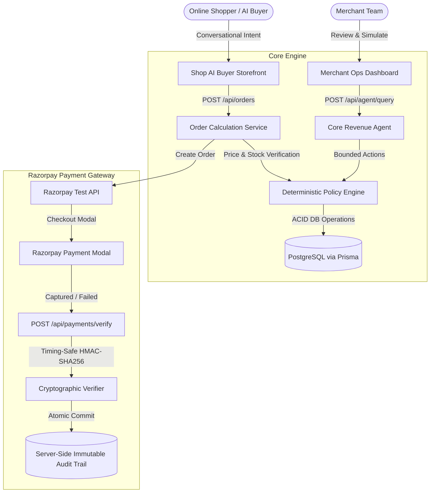

# RAYFLOW — Smart Commerce & Revenue Growth Platform

[](https://www.typescriptlang.org/)
[](https://nextjs.org/)
[](https://www.prisma.io/)
[](https://razorpay.com/)
[](https://rayflow-omega.vercel.app)
[](https://opensource.org/licenses/MIT)

> **Core Architectural Principle:**  
> *"AI recommends. Deterministic systems calculate. Policies constrain. Humans approve risky actions. Razorpay verifies payment. The database records the result."*

**Live Production URL**: [https://rayflow-omega.vercel.app](https://rayflow-omega.vercel.app)

---

## 🌟 Executive Summary

**RAYFLOW** is a production-grade commerce and revenue platform built for the **Razorpay AI Buildathon 2026 (Track 01: AI Growth & Agentic Commerce)**. It bridges the gap between conversational AI intelligence and financial safety:

1. **Grows Merchant Revenue**: Continuously surfaces high-affinity bundle recommendations, checkout recovery incentives, and targeted campaigns from real database telemetry.
2. **Smart Commerce Storefront**: Enables shoppers to browse live inventory, receive smart bundle incentives, and complete Razorpay test checkouts with zero cart loss.
3. **Deterministic Policy Controls**: Enforces strict, deterministic governance with hard discount caps ($\le 20\%$), campaign budget caps ($\le ₹50,000$), single transaction velocity limits ($\le ₹25,000$), and human approval thresholds ($>15\%$).
4. **Server-Side Financial Security**: Timing-safe HMAC-SHA256 signature verification (`crypto.timingSafeEqual`) for all test-mode payments and webhooks with idempotent ledger recording.
5. **Strict Multi-Tenancy**: Tenant context is resolved strictly from verified server-side JWT session cookies—cross-tenant data leakage is cryptographically prevented.

---

## 🏗 System Architecture



---

## 🔑 Demo Login Credentials

For testing and evaluating pre-seeded merchant store and customer data:

| Portal | Role | Email | Password | Details |
| :--- | :--- | :--- | :--- | :--- |
| **Merchant Portal (`/merchant/login`)** | **Aura Athletics (Admin)** | `arjun@auraathletics.com` | `demo123` | Pre-seeded sportswear store with catalogue, opportunities & orders |
| **Merchant Portal (`/merchant/login`)** | **Aura Athletics (Member)** | `pooja@auraathletics.com` | `demo123` | Operator role requiring approval for >15% discounts |
| **Merchant Portal (`/merchant/login`)** | **Zenith Active (Tenant B)** | `rohan@zenithactive.com` | `zenith123` | Multi-tenant isolated workspace |
| **Customer Storefront (`/shop`)** | **Priya Sharma (Shopper)** | `priya@auraathletics.com` | `demo123` | 1-Click instant demo customer for testing checkout |

---

## 🚀 Quick Start (Local Setup)

```bash
# 1. Clone the repository
git clone https://github.com/RAj26-luj/rayflow.git
cd rayflow

# 2. Install dependencies (initializes Husky hooks)
npm install

# 3. Configure environment
cp .env.example .env.local

# 4. Generate Prisma Client & apply baseline migrations
npm run prisma:generate
npm run prisma:deploy
npm run prisma:seed

# 5. Launch the local dev server
npm run dev
```

Open [http://localhost:3000](http://localhost:3000) in your browser.

---

## 🔐 Environment Variables Reference

| Variable | Required | Default / Example | Purpose |
| :--- | :---: | :--- | :--- |
| `DATABASE_URL` | **Yes** | `postgresql://...` | Prisma PostgreSQL database connection string |
| `DATABASE_URL_UNPOOLED` | Optional | `postgresql://...` | Direct connection string for migrations |
| `NEXTAUTH_SECRET` | **Yes** | `openssl rand -base64 32` | 32+ char secret for JWT cookie encryption |
| `NEXTAUTH_URL` | **Yes** | `https://rayflow-omega.vercel.app` | Canonical application URL |
| `RAZORPAY_KEY_ID` | Optional | `rzp_test_...` | Razorpay API Key ID (Test Mode) |
| `RAZORPAY_KEY_SECRET` | Optional | `rzp_secret_...` | Razorpay Key Secret for HMAC verification |
| `RAZORPAY_WEBHOOK_SECRET`| Optional | `whsec_...` | Secret for validating webhook signatures |
| `NEXT_PUBLIC_RAZORPAY_KEY_ID` | Optional | `rzp_test_...` | Client-side public key for Razorpay checkout |
| `DEMO_MODE` | Optional | `"false"` (prod) / `"true"` (dev) | When `false`, disables destructive resets |
| `AI_PROVIDER` | Optional | `"deterministic"` | `"deterministic"` (zero-cost) or `"openrouter"` |
| `OPENROUTER_API_KEY` | Optional | `sk-or-v1-...` | Server-side API key if using OpenRouter LLM |
| `DEFAULT_AI_MODEL` | Optional | `google/gemini-2.5-flash` | Model identifier if using OpenRouter |

---

## 🧪 Quality Gates & Automated Verification

RAYFLOW maintains a rigorous automated testing pipeline (12 test suites, 78 tests passing):

```bash
# Run ESLint validation (0 errors)
npm run lint

# Run TypeScript static typecheck (0 errors)
npm run typecheck

# Run Vitest unit & multi-tenant isolation integration test suite (78 tests)
npm test

# Run full production Next.js compilation
npm run build
```

---

## 🛡 Security Invariants

1. **Zero Client Trust**: Pricing, discount calculations, inventory validation, and margin ceilings are executed strictly server-side from PostgreSQL records.
2. **Timing-Safe HMAC**: Signature verification utilizes `crypto.timingSafeEqual` against side-channel timing attacks.
3. **Session-Driven Tenancy**: Multi-tenant authorization strictly validates verified JWT session claims against database records.
4. **Server-Side Immutable Audit Ledger**: Every agent query, policy evaluation, opportunity state transition, and payment capture is recorded with correlation IDs and timestamps.

---

## 📄 License

MIT License. Built for the **Razorpay AI Buildathon 2026**.
